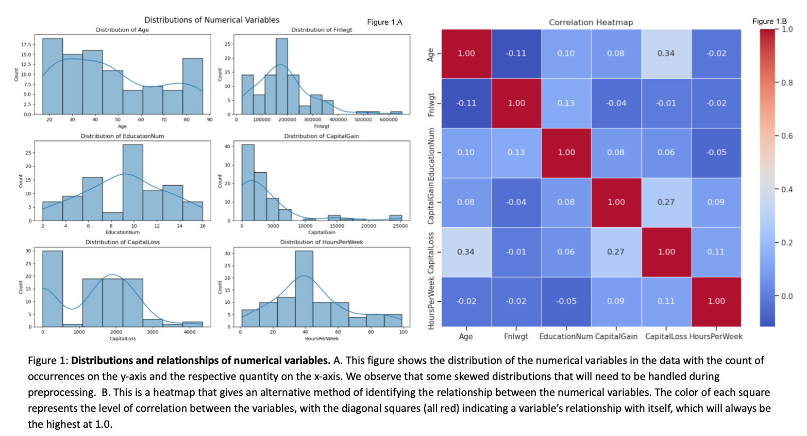
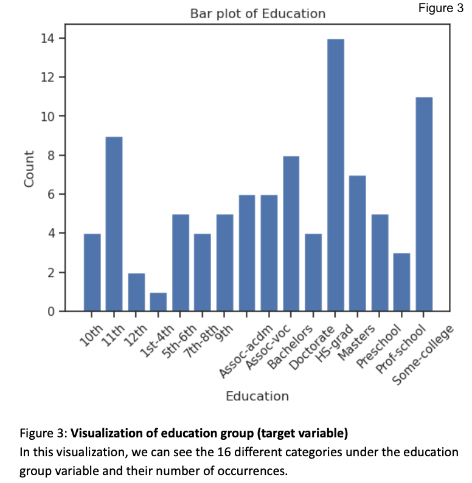
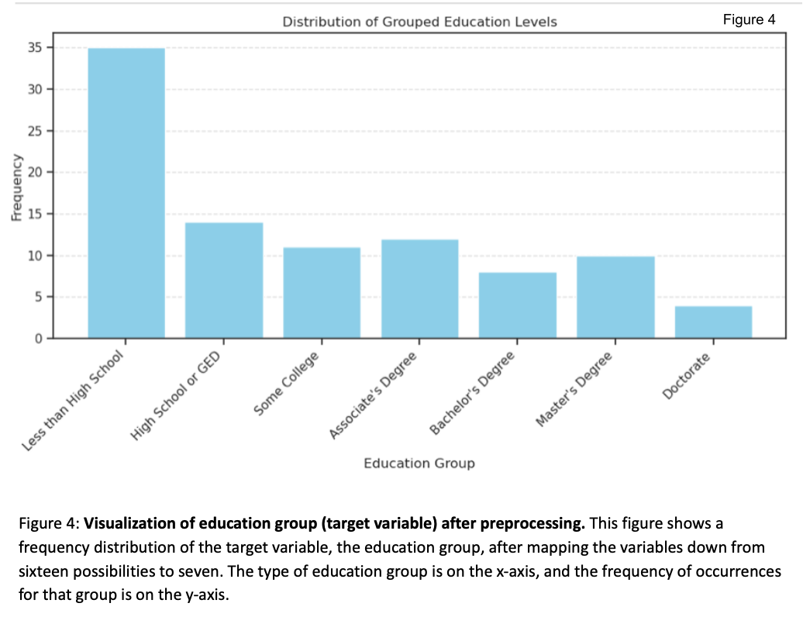

<div align="center">  
    <h1> 
        DSC232R Spring 2024 Group Project<br>
        Exploring Demographic and Socioeconomic Influences on Educational Attainment
    </h1>
</div>

## Table of Contents
- [Introduction](#introduction)
- [Submissions](#submissions)
  - [Milestone 2](#milestone-2)
  - [Milestone 3](#milestone-3)
  - [Milestone 4](#milestone-4)
- [Code](#code)
- [Written Report](#written-report)
  - [Introduction of Project](#introduction-of-project)
  - [Figures](#figures)
  - [Methods](#methods)
  - [Results](#results)
  - [Discussion](#discussion)
  - [Conclusion](#conclusion)
  - [Statement of Collaboration](#statement-of-collaboration)
  - [Final Model And Results Summary](#final-model-and-results-summary)


## Introduction

This project aims to explore how various demographic and socioeconomic factors, such as geography, income, and age, shape individuals' educational attainment levels. By analyzing a simulated dataset representing diverse populations worldwide and their various characteristics, we aim to identify patterns and classifications using a variety of analytical methods. Our goal is to develop a predictive model that accurately explains the factors contributing to low educational attainment. The findings of this research could inform policy changes and raise awareness about the significant obstacles preventing access to education. Moreover, this study highlights the potential impact on regional economies and societies as education levels rise among the population.

## Submissions

### Milestone 2

#### Data Exploration

In order to gain understanding of the data set, we performed various data exploration tasks including visualizations of data distributions and relationships, determining data types, and exploring the size and quality of the data. We found that we have a total of six numerical type variables and nine categorical variables. 

The data were collected from the 1994 census database.  The data were collected using the following conditions: age is between 16 and 100, the number of hours worked in a week is more than 0, and the final weight is more than 1.

Below we have a description of the data and the observations that were made. 

| Data Type   |  Observations                                                                                             |
|-------------|----------------------------------------------------------------------------------------------------------|
| Age |The majority of the participants in the dataset are under 50 years old.  The distribution appears to be trimodal with a prominent peak in ages from 16-25, followed by another peak in ages from 40-50.  The third peak is in ages from 80+.  This distribution seems to generally match the distribution of age in the general population. In the general population, 8.7% of people are 19-25 years old, 12.3% of people are 26-34 years old, 25.7% of people are 35-54 years old, 12.9% of people are 55-64 years old, and 17.4% of people are over 65.|
|Capital Gains|The distribution of capital gains is heavily right skewed.  The majority of people had $0 income from capital gains.  If one had income from capital gains it was most likely under $5,000.  There are a few people that had income from capital gains in excess of $5,000 with a maximum value of approximately $25,000.|
|Capital Loss|Similar to capital gains, most people did not have any capital loss either.  This distribution is bimodal with a peak at 0, indicating most people did not lose any money by the sale of assets.  There is another peak in the data around $2,000 dollars indicating if one did lose money from the sale of assets, it was typically around $2,000.|
|Hours worked per week|The distribution of the number of hours worked is mostly symmetric with the peak at 35 - 39 hours.  In the U.S. women work an average of 36.6 hours per week and men work an average of 40.5 hours per week.  This is likely due to the increase of women that work part-time compared to men.|
|Work Class|The majority of people are employed by private companies.  After private companies, it is a fairly even distribution of employers between the remaining groups.|
|Education|The majority of people earned a high school education.  The lowest education level achieved was a Preschool education, which occurred more frequently than a doctorate degree.  After a high school degree, the most common highest level of education is some college, followed by 11th grade.|  
|Marital Status|There are several categories that refer to being married, such as married to a civilian, married to a spouse in the armed forces, or married to a spouse that lives a long distance away.  When these categories are combined, marriage is the most common status in this dataset.|
|Race and Gender|71% of the population in the U.S. identifies as white, 12.2% identify as black, and 5.6% identify as Asian.  This demographic breakdown in this data is similar, as seen  in the bar chart on race.  Females comprise 51.1% of the population in the U.S.  The distribution of gender in this data also shows more females than males.|
|Income|While income is typically a quantitative variable, in this data income has been categorized into 2 classes, less than or equal to $50,000 or more than $50,000.  Given that the median income in the U.S. in 2022 is $37,585 it is not surprising that the majority of participants earn less than or equal to $50,000 in our dataset as well.|

When examining how the quantitative data are correlated, using a correlation heat map, some interesting patterns were observed.  One of the strongest correlations present in the data is as age increases one is more likely to incur capital loss.  As expected, capital loss and capital gains are positively correlated.  In addition, the number of hours worked each week is positively correlated with an increase in capital gains and capital loss.  Indicating that those who work more hours are more likely to have assets to gain and lose money from.  Surprisingly, the number of hours worked per week and level of education are negatively correlated, but it is important to note the correlation is not strong.   


#### Preprocessing Plan

During the data exploration phase, we found that the data collection was already relatively clean. We found no null or missing values for any of the variables, so no imputation or handling of nulls will be needed. During the data exploration we did observe some skewing of distributions, but little evidence of outliers. The issue of skewed distributions can be handled during the preprocessing stage with normalization of the skewed variables. 

We have varying types of data, including a mix of numerical and categorical variables. To properly handle these variables during the modeling process we will perform both scaling of the numerical variables and encoding of the categorical variables. Scaling will ensure that our varying numerical values, like age and capital gains, can be properly compared on an even field. Encoding of the categorical variables will allow us to perform various classification tasks. We have both ordinal categorical variables like education (High School < Associates < Bachelors < Masters), as well as nominal categorical variables like occupation. Ordinal categorical variables can be encoded via mapping or Label Encoding, while the nominal categorical variables can be encoded with one-hot encoding. The varying techniques of encoding the ordinal and nominal categorical variables ensure that the model will not create unsubstantiated relationships between variables. 

### Milestone 3

#### Preprocessing Execution
We condensed the education categories from 16 possible response variables to 7 response variables. This included mapping any education level between pre-school and 12th grade to "Less than High School", and mapping both "Masters" and "Prof-school" to the variable "Master's Degree". In the end, the resulting 7 possible response variables from this mapping were "Less than High School", "High School or GED", "Some College", "Associates Degree", "Bachelor's Degree", "Master's Degree", and "Doctorate".  

Numerical variables for the dataset were ultimately transformed in two ways. First, all numerical variables outlined above (Age, Fnlwgt, EducationNum, CaptialGain, CapitalLoss, and HoursPerWeek) were compiled into a vector and added to the "NumericalDataType" column. Second, numerical variables were scaled using StandardScaler to ensure that all numerical variables were appropriately represented by a normal distribution, which resolves the issue of skewing addressed above. 

Categorical variables for the dataset were ultimately transformed by the deployment of the StringIndexer function. Categorical variables were transformed from string type to numeric type, where indices were assigned according to the label frequencies. In this case, the most frequent labels were given an index of 0.0. This transformation of the categorical variables will allow for proper use and representation in the following model stage of the project. The transformed categorical variables included ['WorkClassIndexed', 'MaritalStatusIndexed', 'OccupationIndexed', 'RelationshipIndexed', 'RaceIndexed', 'SexIndexed', 'NativeCountryIndexed', 'IncomeIndexed']. 

After the preprocessing of the numerical and categorical variables, a final data frame containing the transformed variables was created. In addition, a 60/20/20 train, test, and validation split was performed on the data for use in the model-building stage. The randomSplit function was employed with seed=13. Ultimately, the features of the model-building stage were the categorical variables outlined above in addition to the numerical variable vector in 'NumericalDataTypeTransformed'. The target variable was determined to be 'EducationGroupIndexed', which was also indexed using the StringIndex function to assign numerical index labels to the varying education levels. 

#### Creation and Conclusion of First Model
The first model selected was a logistic regression model.  Logistic regression models are classification models used to predict outcomes based on the features of the data. Logistic regression uses the sigmoid function to map a linear combination of the features to a probability score for each class and the class with the highest probability is the predicted class for the sample.  Logistic regression assumes there is a linear relationship between the features and label and independence between the features.  While the correlation analysis on the data did not show a high correlation between the features, some of the features such as age and capital loss, and capital loss and capital gain did show moderate correlation.  

The overall accuracy of the model was low, at 46%.  Some possible reasons for the low accuracy of the model are a non-linear relationship between the features and outcome exists; the data are highly imbalanced, with the majority of samples having a high school education; overfitting, too complex of a model for the data available; missing data; and outliers.  Some possible steps to improve this model would be to reduce the number of features, remove data with outliers, and balance the data by removing some of the samples with a high school education.  However, since it is possible a non-linear relationship exists, we hope to have better success with a random forest model.

#### Additional Models
Given the goal to predict education level based on various demographic and socioeconomic factors, such as geography, income, and age, shape individuals' educational attainment levels, a classification model is needed.  Some options for classification models are K-nearest neighbors, SVM, and random forests.  We have selected to use a random forest as the next model to predict education level.  

Random forests are an ensemble method that fits multiple decision tree classifiers to predict a more accurate outcome.  This recursive splitting allows decision trees to capture complex non-linear relationships and the ensemble approach reduces overfitting and improves performance.  Each decision tree is trained on a random subset of features at each split. This randomness helps to decorrelate the trees within the ensemble and can be beneficial when dealing with dependent features. By considering only a subset of features at each split, random forests can mitigate the impact of multicollinearity or dependencies between features.  

The advantages of random forests are there are more options for hyperparameter tuning which could help us to improve the fit of our model, the model is robust to missing or noisy data, and the model is highly scalable. Since random forests do not assume a linear relationship in the data they can model more complex data.  

### Milestone 4

## Code 

[Milestone 2 Jupyter Notebook](https://github.com/allison-conrey/DSC232R-GroupProject/blob/main/Milestone%202.ipynb)

[Milestone 3 Jupyter Notebook](https://github.com/allison-conrey/DSC232R-GroupProject/blob/main/Milestone3.ipynb).

## Written Report 

### Introduction of Project
Socioeconomic status (SES) encompasses an individual's economic and social standing, typically measured by factors like education, income, and occupation.4 Higher SES correlates with better health outcomes, attributed to factors like access to healthcare and healthier lifestyles.3 While SES doesn't directly cause chronic diseases, it reflects environmental and lifestyle influences that contribute to their likelihood.4  Access to quality education throughout life, including college education, is a key component in increasing SES.2  Increased SES plays a pivotal role in improving health by enhancing access to resources and opportunities.  Steady employment decreases the likelihood of poverty and the associated health risks of living in poverty.1  People with college educations are half as likely to be unemployed as their peers who only have a high school degree.5  Those with a bachelor’s degree earn on average 86% more than those with a high school education.5  In fact, college graduates on average make 1.2 million more over their lifetime.5  

Education is essential to the economic growth and development of a nation.7  The economic market is changing everyday and education helps to prepare students for the current and changing job market.7  “Educational attainment is a defining factor in people’s future success, and helps reduce inequality.”8  However, it has been shown that children from low SES families do not have the same access to high-quality schools, technology, extracurricular activities, and tutors.8  Furthermore, children from low SES tend to have poor cognitive development, language, memory, and socio-emotional processing.  These factors contribute to higher dropout rates that perpetuate the low SES intergenerational trap.6,8  

This study aims to explore economic and social factors influencing educational attainment, aiming to inform policies to elevate SES, reduce poverty, and enhance health and well-being.  By analyzing a simulated dataset representing diverse populations worldwide and their various characteristics, we aim to identify patterns and classifications using a variety of analytical methods. Our goal is to develop a predictive model that accurately explains the factors contributing to low educational attainment. The findings of this research could inform policy changes and raise awareness about the significant obstacles preventing access to education. Moreover, this study highlights the potential impact on regional economies and societies as education levels rise among the population.
### Figures
### Methods
#### Data Exploration
In the data exploration phase, we first examined the data for missingness and noise using the isNull() function.  We then examined the variables present in the data to understand their types and formats using the describe() and show() functions. 

Next, we created visualizations to identify the distributions of the data and any skewing(Fig 1.A, Fig 2).  We plan to address skewed distributions by normalizing the relevant variables during preprocessing. In addition, we sought to identify any relationships between numerical variables(Fig 1). Evidence of grouping, linear relationships, or other types of trends can assist in deciding which ML model will best suit the data. The last step in the data exploration process was to visualize the distribution of our target variable, the education group (Fig.3). 

#### Pre-Processing 
We have varying types of data, including a mix of numerical and categorical variables. To properly handle these variables during the modeling process we will perform both scaling of the numerical variables and encoding of the categorical variables.

Starting with the numerical variables,  scaling will ensure that our varying numerical values, like age and capital gains, can be properly compared on an even field. To complete this process all of the numerical variables are first transformed into a vector, and the numerical variables are scaled using the StandardScaler() function. The StandardScaler() function works by transforming the varying numerical values so that they have a mean of zero and a standard deviation of 1, representing a normal distribution. This ensures that all numerical values are on the same scale. During this stage of the preprocessing, we also performed a 60-20-20 train-test-validation split on the data. 

``` 
vector_assembler = VectorAssembler().setInputCols(NumericalDataType).setOutputCol('NumericalDataType')
spark_dataframe_transformed = vector_assembler.transform(spark_dataframe_with_grouped_education)
list_of_columns = list(spark_dataframe_with_grouped_education.columns)
train_split, test_split, validation_split = spark_dataframe_transformed.randomSplit([0.6, 0.2, 0.2], seed=13)
CatergoricalDataType = [el for el in list_of_columns if el not in NumericalDataType]


def flatten(df):
   return df.withColumn("NumericalDataTypeTransformed", vector_to_array(F.col('NumericalDataTypeTransformed'))) \
       .select(CatergoricalDataType + [F.col("NumericalDataTypeTransformed")[i].alias(c + "Scaled") for i, c in enumerate(NumericalDataType)])


scaler_model = StandardScaler().setInputCol('NumericalDataType').setOutputCol('NumericalDataTypeTransformed').fit(train_split)
scaled_train = flatten(scaler_model.transform(train_split))
scaled_test = flatten(scaler_model.transform(test_split))
scaled_validation = flatten(scaler_model.transform(validation_split)

``` 

The next step of the preprocessing phase was to handle the categorical variables. As identified in the data exploration phase, the target variable of the education group had a total of 16 possible values. For best use in our machine learning model and ease of analysis, we decided to condense some of these values into one. This included mapping any education level between pre-school and 12th grade to "Less than High School", and mapping both "Masters" and "Prof-school" to the variable "Master's Degree". In the end, the resulting 7 possible response variables from this mapping were "Less than High School", "High School or GED", "Some College", "Associates Degree", "Bachelor's Degree", "Master's Degree", and "Doctorate".

``` 
# Define a function to map education levels to groups
def group_education_level(education_label):
   education_index_mapping = {
       'HS-grad': 'High School or GED',
       'Some-college': 'Some College',
       'Bachelors': "Bachelor's Degree",
       'Masters': "Master's Degree",
       'Assoc-voc': "Associate's Degree",
       '11th': 'Less than High School',
       'Assoc-acdm': "Associate's Degree",
       '10th': 'Less than High School',
       '7th-8th': 'Less than High School',
       '9th': 'Less than High School',
       'Prof-school': "Master's Degree",
       '12th': 'Less than High School',
       'Doctorate': 'Doctorate',
       '5th-6th': 'Less than High School',
       'Preschool': 'Less than High School',
       '1st-4th': 'Less than High School'
   }
   return education_index_mapping.get(education_label, 'Other')


# Define a UDF to apply the function to each row of the DataFrame
group_education_udf = udf(group_education_level, StringType())


# Apply the UDF to create a new column for grouped education levels
spark_dataframe_with_grouped_education = spark_dataframe.withColumn('EducationGroup', group_education_udf(spark_dataframe['Education']))


sampled_df_with_grouped_education = spark_dataframe_with_grouped_education.sample(withReplacement = False, fraction = 0.001, seed = 505)
```

The last step of the preprocessing is to encode the categorical variables for use in the machine learning model. For use in logistic regression, all categorical variables must have a numerical representation. In our case, this means both the feature variables and the target variables need to be transformed into their numerical representation.  This was achieved by using the StringIndexer() function to assign a numerical value to each categorical variable. The label and index values were then mapped for the education groups for interpretation once the model was employed. 

``` 
list_of_columns = list(spark_dataframe_with_grouped_education.columns)
string_indexer = StringIndexer(inputCols=CatergoricalDataType, outputCols=[el + "Indexed" for el in CatergoricalDataType])
indexer_model = string_indexer.fit(train_split)
indexed_train = indexer_model.transform(scaled_train)
indexed_test = indexer_model.transform(scaled_test)
indexed_validation = indexer_model.transform(scaled_validation)


education_indexer_model = indexer_model


# Retrieve the index mapping labels for the 'EducationGroup' column
educationgroup_mapping = education_indexer_model.labelsArray[8]  # 'Education' is the ninth indexed column


# Print the index mapping for the 'EducationGroup' column
print("Index mapping for 'EducationGroup' column:")
for index, label in enumerate(educationgroup_mapping):
   print(f"Index: {index} --> Label: {label}")
``` 

#### Model 1
The first model chosen was a Logistic Regression model. For this model, we used the vector representation of the numerical variables created during the preprocessing phases, as well as the transformed categorical variables. The target variable for the classification of the logistic regression model was the education group. For this first iteration, we decided not to use any hyperparameter tuning. 
``` 
from pyspark.ml.classification import LogisticRegression
from pyspark.ml import Pipeline

# Define the features (X) and target variable (y) columns
feature_columns = ['WorkClassIndexed', 'MaritalStatusIndexed', 'OccupationIndexed', 'RelationshipIndexed', 'RaceIndexed', 'SexIndexed', 'NativeCountryIndexed', 'IncomeIndexed', 'NumericalDataTypeTransformed']
label_column = 'EducationGroupIndexed'

# Define VectorAssembler to assemble features into a single vector column
vector_assembler = VectorAssembler(inputCols=feature_columns, outputCol='features')

# Create Logistic Regression model
lr = LogisticRegression(featuresCol='features', labelCol=label_column)

# Create a pipeline with VectorAssembler and Logistic Regression model
pipeline = Pipeline(stages=[vector_assembler, lr])

# Fit the pipeline to the training data
model = pipeline.fit(train)
```


### Results
#### Data Exploration
We found the data was relatively clean with no null values, requiring minimal cleaning to make it ready.  While some skewing of distributions was observed, outliers were minimal.

We found that we had a total of six numerical and nine categorical variables. The six numerical variables include ‘Age’, ‘Capital Gains’, ‘Capital Loss’, ‘Hours Worked per Week’, ‘Fnlwgt’, and ‘Education number’. The nine categorical variables included ‘Work Class’, ‘Education’, ‘Occupation’, ‘Marital Status’, ‘Relationship’, ‘Race’, ‘Sex’, ‘Income’, and ‘Native Country’. We found that with a mix of numerical and categorical variables, scaling and encoding would need to occur in the preprocessing phase.

After plotting the distribution and heatmap correlations of the numerical variables we found that there was little correlation between the numerical variables. A lack of correlation in the numerical variables suggests minimal amounts of multicollinearity, which is beneficial when employing models like logistic regression. We did find that only ‘Education Number’ and ‘Hours per week’ showed a relatively normal distribution. The other numerical variables showed mostly right-skewed distributions that can be corrected in the preprocessing phase. 



When plotting the categorical variables we found that the variables ‘Sex’ and ‘Income’ had a relatively even split between their two possible values. The vast majority of the data described the “United States” as being the ‘Native Country’, “Private” as the ‘Work Class’, and the ‘Race’ as being “White”. Education and Occupation proved to both represent multimodal distributions, white relationships and marital status had a relatively even spread of data across their respective categories. In summary, the categorical variables had a variety of distribution types, which will be important to consider during the analysis phase. 


When looking at the target variable ‘Education Group’ we found that there were 16 possible education group values for the target variable ranging from 1st grade to Doctorate. The categories with the highest counts include 11th grade, High School Graduate, and Some College. For a classification task, 16 possible values may pose challenges to the model with minimal benefit. Streamlining the target variable and condensing the possible values will be addressed in the preprocessing phase. 



#### Pre-Processing

Our preprocessing steps included : 
Encoding Categorical variables
Scaling Numerical Variables 

After preprocessing, our numerical data was transformed into numerical vectors to make it more compatible with machine learning models. During this process, the distributions of the numerical variables were also standardized, with a mean of 0 and a standard deviation of 1. This process helps with the data that we noted was skewed to the right and created normal distributions for all of the numerical variables. The categorical variables were encoded with numeric values so that they could be properly employed in our desired machine learning models, including the target variable ‘Education Group’. 

The target variable, ‘Education Group’, was mapped from sixteen values to seven possible values. The results of that mapping are shown below in the updated histogram. 



#### Model 1

#### Model 2

### Discussion 
### Conclusion
### Statement of Collaboration 

## Authors

Allison Conrey 
alconrey@ucsd.edu

Konrad Kaim 
kkaim@ucsd.edu 

Filina Nurcahya 
Fnurcahyatjoa@ucsd.edu

Caroline Hutchings
Chutchings@ucsd.edu

Camryn Curtis 
cscurtis@ucsd.edu 


### Data Scheme

root
 |-- Age: float (nullable = true)
 |-- WorkClass: string (nullable = true)
 |-- Fnlwgt: float (nullable = true)
 |-- Education: string (nullable = true)
 |-- EducationNum: float (nullable = true)
 |-- MaritalStatus: string (nullable = true)
 |-- Occupation: string (nullable = true)
 |-- Relationship: string (nullable = true)
 |-- Race: string (nullable = true)
 |-- Sex: string (nullable = true)
 |-- CapitalGain: float (nullable = true)
 |-- CapitalLoss: float (nullable = true)
 |-- HoursPerWeek: float (nullable = true)
 |-- NativeCountry: string (nullable = true)
 |-- Income: string (nullable = true)
