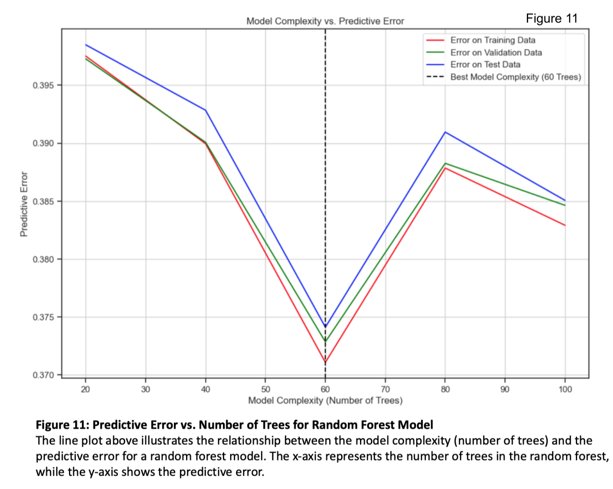

<div align="center">  
    <h1> 
        DSC232R Spring 2024 Group Project<br>
        Exploring Demographic and Socioeconomic Influences on Educational Attainment
    </h1>
</div>

## Table of Contents
- [Abstract](#abstract)
- [Submissions](#submissions)
  - [Milestone 2](#milestone-2)
  - [Milestone 3](#milestone-3)
  - [Milestone 4](#milestone-4)
- [Code](#code)
- [Written Report](#written-report)
  - [Introduction](#introduction)
  - [Methods](#methods)
  - [Results](#results)
  - [Discussion](#discussion)
  - [Conclusion](#conclusion)
  - [Statement of Collaboration](#statement-of-collaboration)
  - [Final Model And Results Summary](#final-model-and-results-summary)
  - [References](#references)


## Abstract

This project aims to explore how various demographic and socioeconomic factors, such as geography, income, and age, shape individuals' educational attainment levels. By analyzing a simulated dataset representing diverse populations worldwide and their various characteristics, we aim to identify patterns and classifications using a variety of analytical methods. Our goal is to develop a predictive model that accurately explains the factors contributing to low educational attainment. The findings of this research could inform policy changes and raise awareness about the significant obstacles preventing access to education. Moreover, this study highlights the potential impact on regional economies and societies as education levels rise among the population.

## Submissions

### Milestone 2

#### Data Exploration

In order to gain understanding of the data set, we performed various data exploration tasks including visualizations of data distributions and relationships, determining data types, and exploring the size and quality of the data. We found that we have a total of six numerical type variables and nine categorical variables. 

The data were collected from the 1994 census database.  The data were collected using the following conditions: age is between 16 and 100, the number of hours worked in a week is more than 0, and the final weight is more than 1.

Below we have a description of the data and the observations that were made. 

| Data Type   |  Observations                                                                                             |
|-------------|----------------------------------------------------------------------------------------------------------|
| Age |The majority of the participants in the dataset are under 50 years old.  The distribution appears to be trimodal with a prominent peak in ages from 16-25, followed by another peak in ages from 40-50.  The third peak is in ages from 80+.  This distribution seems to generally match the distribution of age in the general population. In the general population, 8.7% of people are 19-25 years old, 12.3% of people are 26-34 years old, 25.7% of people are 35-54 years old, 12.9% of people are 55-64 years old, and 17.4% of people are over 65.|
|Capital Gains|The distribution of capital gains is heavily right skewed.  The majority of people had $0 income from capital gains.  If one had income from capital gains it was most likely under $5,000.  There are a few people that had income from capital gains in excess of $5,000 with a maximum value of approximately $25,000.|
|Capital Loss|Similar to capital gains, most people did not have any capital loss either.  This distribution is bimodal with a peak at 0, indicating most people did not lose any money by the sale of assets.  There is another peak in the data around $2,000 dollars indicating if one did lose money from the sale of assets, it was typically around $2,000.|
|Hours worked per week|The distribution of the number of hours worked is mostly symmetric with the peak at 35 - 39 hours.  In the U.S. women work an average of 36.6 hours per week and men work an average of 40.5 hours per week.  This is likely due to the increase of women that work part-time compared to men.|
|Work Class|The majority of people are employed by private companies.  After private companies, it is a fairly even distribution of employers between the remaining groups.|
|Education|The majority of people earned a high school education.  The lowest education level achieved was a Preschool education, which occurred more frequently than a doctorate degree.  After a high school degree, the most common highest level of education is some college, followed by 11th grade.|  
|Marital Status|There are several categories that refer to being married, such as married to a civilian, married to a spouse in the armed forces, or married to a spouse that lives a long distance away.  When these categories are combined, marriage is the most common status in this dataset.|
|Race and Gender|71% of the population in the U.S. identifies as white, 12.2% identify as black, and 5.6% identify as Asian.  This demographic breakdown in this data is similar, as seen  in the bar chart on race.  Females comprise 51.1% of the population in the U.S.  The distribution of gender in this data also shows more females than males.|
|Income|While income is typically a quantitative variable, in this data income has been categorized into 2 classes, less than or equal to $50,000 or more than $50,000.  Given that the median income in the U.S. in 2022 is $37,585 it is not surprising that the majority of participants earn less than or equal to $50,000 in our dataset as well.|

When examining how the quantitative data are correlated, using a correlation heat map, some interesting patterns were observed.  One of the strongest correlations present in the data is as age increases one is more likely to incur capital loss.  As expected, capital loss and capital gains are positively correlated.  In addition, the number of hours worked each week is positively correlated with an increase in capital gains and capital loss.  Indicating that those who work more hours are more likely to have assets to gain and lose money from.  Surprisingly, the number of hours worked per week and level of education are negatively correlated, but it is important to note the correlation is not strong.   


#### Preprocessing Plan

During the data exploration phase, we found that the data collection was already relatively clean. We found no null or missing values for any of the variables, so no imputation or handling of nulls will be needed. During the data exploration we did observe some skewing of distributions, but little evidence of outliers. The issue of skewed distributions can be handled during the preprocessing stage with normalization of the skewed variables. 

We have varying types of data, including a mix of numerical and categorical variables. To properly handle these variables during the modeling process we will perform both scaling of the numerical variables and encoding of the categorical variables. Scaling will ensure that our varying numerical values, like age and capital gains, can be properly compared on an even field. Encoding of the categorical variables will allow us to perform various classification tasks. We have both ordinal categorical variables like education (High School < Associates < Bachelors < Masters), as well as nominal categorical variables like occupation. Ordinal categorical variables can be encoded via mapping or Label Encoding, while the nominal categorical variables can be encoded with one-hot encoding. The varying techniques of encoding the ordinal and nominal categorical variables ensure that the model will not create unsubstantiated relationships between variables. 

### Milestone 3

#### Preprocessing Execution
We condensed the education categories from 16 possible response variables to 7 response variables. This included mapping any education level between pre-school and 12th grade to "Less than High School", and mapping both "Masters" and "Prof-school" to the variable "Master's Degree". In the end, the resulting 7 possible response variables from this mapping were "Less than High School", "High School or GED", "Some College", "Associates Degree", "Bachelor's Degree", "Master's Degree", and "Doctorate".  

Numerical variables for the dataset were ultimately transformed in two ways. First, all numerical variables outlined above (Age, Fnlwgt, EducationNum, CaptialGain, CapitalLoss, and HoursPerWeek) were compiled into a vector and added to the "NumericalDataType" column. Second, numerical variables were scaled using StandardScaler to ensure that all numerical variables were appropriately represented by a normal distribution, which resolves the issue of skewing addressed above. 

Categorical variables for the dataset were ultimately transformed by the deployment of the StringIndexer function. Categorical variables were transformed from string type to numeric type, where indices were assigned according to the label frequencies. In this case, the most frequent labels were given an index of 0.0. This transformation of the categorical variables will allow for proper use and representation in the following model stage of the project. The transformed categorical variables included ['WorkClassIndexed', 'MaritalStatusIndexed', 'OccupationIndexed', 'RelationshipIndexed', 'RaceIndexed', 'SexIndexed', 'NativeCountryIndexed', 'IncomeIndexed']. 

After the preprocessing of the numerical and categorical variables, a final data frame containing the transformed variables was created. In addition, a 60/20/20 train, test, and validation split was performed on the data for use in the model-building stage. The randomSplit function was employed with seed=13. Ultimately, the features of the model-building stage were the categorical variables outlined above in addition to the numerical variable vector in 'NumericalDataTypeTransformed'. The target variable was determined to be 'EducationGroupIndexed', which was also indexed using the StringIndex function to assign numerical index labels to the varying education levels. 

#### Creation and Conclusion of First Model
The first model selected was a logistic regression model.  Logistic regression models are classification models used to predict outcomes based on the features of the data. Logistic regression uses the sigmoid function to map a linear combination of the features to a probability score for each class and the class with the highest probability is the predicted class for the sample.  Logistic regression assumes there is a linear relationship between the features and label and independence between the features.  While the correlation analysis on the data did not show a high correlation between the features, some of the features such as age and capital loss, and capital loss and capital gain did show moderate correlation.  

The overall accuracy of the model was low, at 46%.  Some possible reasons for the low accuracy of the model are a non-linear relationship between the features and outcome exists; the data are highly imbalanced, with the majority of samples having a high school education; overfitting, too complex of a model for the data available; missing data; and outliers.  Some possible steps to improve this model would be to reduce the number of features, remove data with outliers, and balance the data by removing some of the samples with a high school education.  However, since it is possible a non-linear relationship exists, we hope to have better success with a random forest model.

#### Additional Models
Given the goal to predict education level based on various demographic and socioeconomic factors, such as geography, income, and age, shape individuals' educational attainment levels, a classification model is needed.  Some options for classification models are K-nearest neighbors, SVM, and random forests.  We have selected to use a random forest as the next model to predict education level.  

Random forests are an ensemble method that fits multiple decision tree classifiers to predict a more accurate outcome.  This recursive splitting allows decision trees to capture complex non-linear relationships and the ensemble approach reduces overfitting and improves performance.  Each decision tree is trained on a random subset of features at each split. This randomness helps to decorrelate the trees within the ensemble and can be beneficial when dealing with dependent features. By considering only a subset of features at each split, random forests can mitigate the impact of multicollinearity or dependencies between features.  

The advantages of random forests are there are more options for hyperparameter tuning which could help us to improve the fit of our model, the model is robust to missing or noisy data, and the model is highly scalable. Since random forests do not assume a linear relationship in the data they can model more complex data.  

### Milestone 4
See [Written Report](#written-report)

## Code 

[Milestone 2 Jupyter Notebook](https://github.com/allison-conrey/DSC232R-GroupProject/blob/main/Milestone%202.ipynb)

[Milestone 3 Jupyter Notebook](https://github.com/allison-conrey/DSC232R-GroupProject/blob/main/Milestone3.ipynb).

[Milestone 4 Jupyter Notebook](https://github.com/allison-conrey/DSC232R-GroupProject/blob/main/Milestone4.ipynb).

## Written Report 

### Introduction
Socioeconomic status (SES) encompasses an individual's economic and social standing, typically measured by factors like education, income, and occupation.4 Higher SES correlates with better health outcomes, attributed to factors like access to healthcare and healthier lifestyles.3 While SES doesn't directly cause chronic diseases, it reflects environmental and lifestyle influences that contribute to their likelihood.4  Access to quality education throughout life, including college education, is a key component in increasing SES.2  Increased SES plays a pivotal role in improving health by enhancing access to resources and opportunities.  Steady employment decreases the likelihood of poverty and the associated health risks of living in poverty.1  People with college educations are half as likely to be unemployed as their peers who only have a high school degree.5  Those with a bachelor’s degree earn on average 86% more than those with a high school education.5  In fact, college graduates on average make 1.2 million more over their lifetime.5  

Education is essential to the economic growth and development of a nation.7  The economic market is changing every day and education helps to prepare students for the current and changing job market.7  “Educational attainment is a defining factor in people’s future success, and helps reduce inequality.”8  However, it has been shown that children from low SES families do not have the same access to high-quality schools, technology, extracurricular activities, and tutors.8  Furthermore, children from low SES tend to have poor cognitive development, language, memory, and socio-emotional processing.  These factors contribute to higher dropout rates that perpetuate the low SES intergenerational trap.6,8  

This study aims to explore economic and social factors influencing educational attainment, aiming to inform policies to elevate SES, reduce poverty, and enhance health and well-being.  By analyzing a simulated dataset representing diverse populations worldwide and their various characteristics, we aim to identify patterns and classifications using a variety of analytical methods. Our goal is to develop a predictive model that accurately explains the factors contributing to low educational attainment. The findings of this research could inform policy changes and raise awareness about the significant obstacles preventing access to education. Moreover, this study highlights the potential impact on regional economies and societies as education levels rise among the population.

### Methods
Data Exploration
In the data exploration phase, we first examined the data for missingness and noise using the isNull() function.  We then examined the variables present in the data to understand their types and formats using the describe() and show() functions. 
```
# How many records in this dataframe? 
num_records = spark_dataframe.count()
print('Number of records:', num_records)

# Missing Data / Imputations 
null_counts = spark_dataframe.select(*(sum(col(c).isNull().cast("int")).alias(c) for c in spark_dataframe.columns))
null_counts.show()

# Describe the Data
spark_dataframe.describe()

# Display basic statistics of numerical columns
print("Basic Statistics of Numerical Columns:")
print(pandas_df.describe())
```

Next, we created visualizations to identify the distributions of the data and any skewing (Fig 1.A, Fig 2).  We plan to address skewed distributions by normalizing the relevant variables during preprocessing. In addition, we sought to identify any relationships between numerical variables (Fig 1). Evidence of grouping, linear relationships, or other types of trends can assist in deciding which ML model will best suit the data. The last step in the data exploration process was to visualize the distribution of our target variable, the education group (Fig.3). 
```
# Visualize the distribution of numerical columns in a 3 by 2 grid layout
plt.figure(figsize=(12, 10))
plt.suptitle("Distributions of Numerical Variables", fontsize=16)  # Title of the overall plot

for i, column in enumerate(pandas_df[numerical_columns]):
    plt.subplot(3, 2, i + 1)
    sns.histplot(pandas_df[column], kde=True)
    plt.title(f'Distribution of {column}')
plt.tight_layout()
plt.show()

#Pairplot showing the scatter plots and relationships between Numerical Variables 
sns.set(style="ticks")

pp=sns.pairplot(pandas_df, corner='true' )
pp.fig.suptitle("Scatter Plots of Numerical Variables")
plt.show()

# Compute the correlation matrix
corr_matrix = pandas_df.corr()

# Create the heatmap
plt.figure(figsize=(10, 8))
sns.heatmap(corr_matrix, annot=True, cmap='coolwarm', fmt='.2f', linewidths=0.5, annot_kws={"size": 12})
plt.title('Correlation Heatmap')
plt.show()

# Create subplots with a 4x2 grid for the categorical columns
fig, axes = plt.subplots(5, 2, figsize=(12, 16))
fig.suptitle("Distributions of Categorical Variables", fontsize=16, y=1)

# Plot bar plots for each categorical column
for i, column in enumerate(categorical_columns):
    counts = spark_dataframe.groupBy(column).count().orderBy(column).collect()
    categories = [str(row[column]) for row in counts]
    values = [row['count'] for row in counts]
    
    # Access the individual axes correctly
    ax = axes[i // 2, i % 2]
    ax.bar(categories, values, edgecolor='black')
    ax.set_title(f'Distribution of {column}')
    ax.set_xlabel(column)
    ax.set_ylabel('Count')
    ax.grid(axis='y')
    
    # Set ticks and then rotate x-axis labels by 45 degrees and increase font size
    ax.set_xticks(range(len(categories)))
    ax.set_xticklabels(categories, rotation=45, ha='right', fontsize=10)

# Plot bar plot for NativeCountry separately
counts2 = spark_dataframe.groupBy('NativeCountry').count().orderBy('NativeCountry').collect()
categories2 = [str(row['NativeCountry']) for row in counts2]
values2 = [row['count'] for row in counts2]

# Add a long horizontal graph at the bottom for NativeCountry
ax_bottom = plt.subplot2grid((5, 2), (4, 0), colspan=2)
ax_bottom.bar(categories2, values2, edgecolor='black')
ax_bottom.set_title('Distribution of Native Country')
ax_bottom.set_xlabel('NativeCountry')
ax_bottom.set_ylabel('Count')
ax_bottom.grid(axis='y')
ax_bottom.set_xticks(range(len(categories2)))
ax_bottom.set_xticklabels(categories2, rotation=45, ha='right', fontsize=10)

# Hide the empty subplots behind ax_bottom
for ax in axes[-1]:
    ax.set_visible(False)

# Adjust padding between subplots
plt.subplots_adjust(hspace=2)

# Adjust layout and display the plot
plt.tight_layout()
plt.show()

for i in ['Education']:
    value_counts = spark_dataframe.groupBy(i).count().orderBy(i).collect()

    values = [row[i] for row in value_counts]
    frequencies = [row['count'] for row in value_counts]

    plt.bar(values, frequencies)
    plt.xlabel(i)
    plt.ylabel('Count')
    plt.title('Bar plot of {}'.format(i))
    plt.xticks(rotation=45)
    plt.show()

# Count the frequency of each education group
education_group_counts = spark_dataframe_with_grouped_education.groupBy('EducationGroup').count().toPandas()

# Define the order of education groups from least education to most education
education_order = [
    'Less than High School',
    'High School or GED',
    'Some College',
    "Associate's Degree",
    "Bachelor's Degree",
    "Master's Degree",
    'Doctorate',
    'Other'
]

# Filter only the existing education groups before reordering
existing_education_groups = [group for group in education_order if group in education_group_counts['EducationGroup'].values]

# Reorder the education_group_counts DataFrame based on the filtered order
education_group_counts = education_group_counts.set_index('EducationGroup').loc[existing_education_groups].reset_index()

# Plot the distribution of education groups
plt.figure(figsize=(10, 6))
plt.bar(education_group_counts['EducationGroup'], education_group_counts['count'], color='skyblue')
plt.title('Distribution of Grouped Education Levels')
plt.xlabel('Education Group')
plt.ylabel('Frequency')
plt.xticks(rotation=45, ha='right')
plt.grid(axis='y', linestyle='--', alpha=0.7)
plt.tight_layout()
plt.show()
```
Preprocessing 
We have varying types of data, including a mix of numerical and categorical variables. To properly handle these variables during the modeling process we will perform both scaling of the numerical variables and encoding of the categorical variables.

Starting with the numerical variables,  scaling will ensure that our varying numerical values, like age and capital gains, can be properly compared on an even field. To complete this process all of the numerical variables are first transformed into a vector, and the numerical variables are scaled using the StandardScaler() function. The StandardScaler() function works by transforming the varying numerical values so that they have a mean of zero and a standard deviation of 1, representing a normal distribution. This ensures that all numerical values are on the same scale. During this stage of the preprocessing, we also performed a 60-20-20 train-test-validation split on the data. 

```
vector_assembler = VectorAssembler().setInputCols(NumericalDataType).setOutputCol('NumericalDataType')
spark_dataframe_transformed = vector_assembler.transform(spark_dataframe_with_grouped_education)
train_split, test_split, validation_split = spark_dataframe_transformed.randomSplit([0.6, 0.2, 0.2], seed=13)

def flatten(df):
    return df.withColumn("NumericalDataTypeTransformed", vector_to_array(F.col('NumericalDataTypeTransformed'))) \
        .select(CatergoricalDataType + [F.col("NumericalDataTypeTransformed")[i].alias(c + "Scaled") for i, c in enumerate(NumericalDataType)])

scaler_model = StandardScaler().setInputCol('NumericalDataType').setOutputCol('NumericalDataTypeTransformed').fit(train_split)
scaled_train = flatten(scaler_model.transform(train_split))
scaled_test = flatten(scaler_model.transform(test_split))
scaled_validation = flatten(scaler_model.transform(validation_split))

```
The next step of the preprocessing phase was to handle the categorical variables. As identified in the data exploration phase, the target variable of the education group had a total of 16 possible values. For best use in our machine learning model and ease of analysis, we decided to condense some of these values into one. This included mapping any education level between preschool and 12th grade to "Less than High School", and mapping both "Masters" and "Prof-school" to the variable "Master's Degree". In the end, the resulting 7 possible response variables from this mapping were "Less than High School", "High School or GED'', "Some College", "Associates Degree", "Bachelor's Degree", "Master's Degree", and "Doctorate".

``` 
from pyspark.sql.functions import udf
from pyspark.sql.types import StringType

# Define a function to map education levels to groups
def group_education_level(education_label):
    education_index_mapping = {
        'HS-grad': 'High School or GED',
        'Some-college': 'Some College',
        'Bachelors': "Bachelor's Degree",
        'Masters': "Master's Degree",
        'Assoc-voc': "Associate's Degree",
        '11th': 'Less than High School',
        'Assoc-acdm': "Associate's Degree",
        '10th': 'Less than High School',
        '7th-8th': 'Less than High School',
        '9th': 'Less than High School',
        'Prof-school': "Master's Degree",
        '12th': 'Less than High School',
        'Doctorate': 'Doctorate',
        '5th-6th': 'Less than High School',
        'Preschool': 'Less than High School',
        '1st-4th': 'Less than High School'
    }
    return education_index_mapping.get(education_label, 'Other')

# Define a UDF to apply the function to each row of the DataFrame
group_education_udf = udf(group_education_level, StringType())

# Apply the UDF to create a new column for grouped education levels
spark_dataframe_with_grouped_education = spark_dataframe.withColumn('EducationGroup', group_education_udf(spark_dataframe['Education']))

# Count the frequency of each education group
education_group_counts = spark_dataframe_with_grouped_education.groupBy('EducationGroup').count().toPandas()

# Define the order of education groups from least education to most education
education_order = [
    'Less than High School',
    'High School or GED',
    'Some College',
    "Associate's Degree",
    "Bachelor's Degree",
    "Master's Degree",
    'Doctorate',
    'Other'
]

# Filter only the existing education groups before reordering
existing_education_groups = [group for group in education_order if group in education_group_counts['EducationGroup'].values]

# Reorder the education_group_counts DataFrame based on the filtered order
education_group_counts = education_group_counts.set_index('EducationGroup').loc[existing_education_groups].reset_index()

```
The last step of the preprocessing is to encode the categorical variables for use in the machine learning model. For use in logistic regression, all categorical variables must have a numerical representation. In our case, this means both the feature variables and the target variables need to be transformed into their numerical representation.  This was achieved by using the StringIndexer() function to assign a numerical value to each categorical variable. The label and index values were then mapped for the education groups for interpretation once the model was employed. The education groups and their corresponding index number were then printed for future reference. 

```
list_of_columns = list(spark_dataframe_with_grouped_education.columns)
CatergoricalDataType = [el for el in list_of_columns if el not in NumericalDataType]

string_indexer = StringIndexer(inputCols=CatergoricalDataType, outputCols=[el + "Indexed" for el in CatergoricalDataType])
indexer_model = string_indexer.fit(train_split)
indexed_train = indexer_model.transform(scaled_train)
indexed_test = indexer_model.transform(scaled_test)
indexed_validation = indexer_model.transform(scaled_validation)

preprocessed_columns = [el + "Indexed" for el in CatergoricalDataType] + [el + "Scaled" for el in NumericalDataType]
train = indexed_train.select(preprocessed_columns)
test = indexed_test.select(preprocessed_columns)
validation = indexed_validation.select(preprocessed_columns)


# Features (X) for train, test, and validation
feature_columns = [col for col in preprocessed_columns if col != 'EducationGroupIndexed']
label_column = 'EducationGroupIndexed'

education_indexer_model = indexer_model 

# Retrieve the index mapping labels for the 'EducationGroup' column
educationgroup_mapping = education_indexer_model.labelsArray[8]  # 'Education' is the ninth indexed column

# Print the index mapping for the 'EducationGroup' column
print("Index mapping for 'EducationGroup' column:")
for index, label in enumerate(educationgroup_mapping):
    print(f"Index: {index} --> Label: {label}")

```
Model One 
The first model chosen was a Logistic Regression model. For this model, we used the vector representation of the numerical variables created during the preprocessing phases, as well as the transformed categorical variables. The target variable for the classification of the logistic regression model was the education group. For this first iteration, we decided to use a parameter grid search in an attempt to optimize several logistic regression parameters. In addition, we employed the use of the CrossValidator() function to perform 5-fold cross-validation.

``` 
# Define VectorAssembler to assemble features into a single vector column
vector_assembler = VectorAssembler(inputCols=feature_columns, outputCol='features')

# Create Logistic Regression model
lr = LogisticRegression(featuresCol='features', labelCol=label_column)

# Create a pipeline with VectorAssembler and Logistic Regression model
pipeline = Pipeline(stages=[vector_assembler, lr])

# Define the parameter grid to search
paramGrid = ParamGridBuilder() \
    .addGrid(lr.regParam, [0.01, 0.1, 1.0, 10.0]) \
    .addGrid(lr.elasticNetParam, [0.0, 0.5, 1.0]) \
    .addGrid(lr.maxIter, [100, 200, 500]) \
    .addGrid(lr.tol, [1e-4, 1e-3, 1e-2]) \
    .addGrid(lr.fitIntercept, [True, False]) \
    .build()

evaluator = MulticlassClassificationEvaluator(predictionCol="prediction", labelCol="EducationGroupIndexed", metricName="accuracy")

# Create CrossValidator
crossval = CrossValidator(estimator=pipeline,
                          estimatorParamMaps=paramGrid,
                          evaluator=evaluator,
                          numFolds=5)  # Use 5-fold cross-validation

# Fit the cross-validated model to the training data
cvModel = crossval.fit(train)

# Get the best model from cross-validation
bestModel = cvModel.bestModel
```

We then found the accuracy of the model for the training, validation, and test set

```
# Compute accuracy for training set
train_predictions = bestModel.transform(train)
train_accuracy = evaluator.evaluate(train_predictions)

# Compute accuracy for validation set
validation_predictions = bestModel.transform(validation)
validation_accuracy = evaluator.evaluate(validation_predictions)

# Evaluate the best model on the test data
test_predictions = bestModel.transform(test)
test_accuracy = evaluator.evaluate(test_predictions)

# Print accuracies
print("Training Accuracy:", train_accuracy)
print("Validation Accuracy:", validation_accuracy)
print("Test Accuracy:", test_accuracy)

```
We then employed a confusion matrix for the different education groups using the predictions made by the model. 

```
from sklearn.metrics import confusion_matrix, ConfusionMatrixDisplay

# Extract true labels and predictions from test set
y_true = np.array(test.select(label_column).collect()).ravel()
y_pred = np.array(test_predictions.select("prediction").collect()).ravel()

# Create confusion matrix
conf_matrix = confusion_matrix(y_true, y_pred)

# Define the education labels
education_labels = {
    0: 'Less than High School',
    1: 'High School or GED',
    2: 'Some College',
    3: "Associate's Degree",
    4: "Master's Degree",
    5: "Bachelor's Degree",
    6: 'Doctorate'
}

# Map the numeric labels to the corresponding education labels
mapped_labels = [education_labels[label] for label in sorted(education_labels.keys())]

# Plot confusion matrix with education labels
disp = ConfusionMatrixDisplay(confusion_matrix=conf_matrix, display_labels=mapped_labels)
disp.plot(cmap=plt.cm.Blues)
plt.title('Confusion Matrix')
plt.xticks(rotation=45, ha='right')  # Rotate the x-axis labels for better readability
plt.show()

```
Based on the results in the confusion matrix, we then created a histogram visualization that would show the accuracy of the predictions made by the model for each of the education groups. 

```
# Function to calculate per-class accuracy from the confusion matrix
def calculate_per_class_accuracy(conf_matrix):
    per_class_accuracy = conf_matrix.diagonal() / conf_matrix.sum(axis=1)
    return per_class_accuracy

# Calculate per-class accuracy
per_class_accuracy = calculate_per_class_accuracy(conf_matrix)

# Define the education labels
education_labels = {
    0: 'Less than High School',
    1: 'High School or GED',
    2: 'Some College',
    3: "Associate's Degree",
    4: "Master's Degree",
    5: "Bachelor's Degree",
    6: 'Doctorate'
}

# Map the numeric labels to the corresponding education labels
mapped_labels = [education_labels[label] for label in sorted(education_labels.keys())]

# Plot per-class accuracy with education labels
plt.figure(figsize=(12, 8))
plt.bar(mapped_labels, per_class_accuracy, color='blue')
plt.xlabel('Education Level')
plt.ylabel('Accuracy')
plt.title('Per-Class Accuracy Percent')
plt.ylim(0, 1)  # Accuracy ranges from 0 to 1
plt.xticks(rotation=45, ha='right')  # Rotate the x-axis labels for better readability
plt.grid(axis='y')

# Add accuracy values on top of bars
for i in range(len(mapped_labels)):
    plt.text(i, per_class_accuracy[i], f'{per_class_accuracy[i]:.2f}', ha='center', va='bottom')

plt.show()
```
Next, we extracted the coefficient values from the best logistic regression model found above. We then aggregated the coefficients of each feature by taking the mean of the absolute value of the coefficients across all of the education groups (classes). We printed these results and used them to create a visualization of the aggregate coefficient values sorted from highest value to lowest values. 

```
# Extract the coefficients from the best logistic regression model
best_lr_model = bestModel.stages[-1]

# Check if the model is binary or multinomial
if best_lr_model.numClasses == 2:
    # For binary classification
    coefficients = best_lr_model.coefficients.toArray()
    intercept = best_lr_model.intercept
else:
    # For multinomial classification
    coefficients = best_lr_model.coefficientMatrix.toArray()
    intercept = best_lr_model.interceptVector.toArray()

# Aggregate coefficients
if best_lr_model.numClasses == 2:
    # For binary classification, use coefficients directly
    feature_coefficients = {feature: coef for feature, coef in zip(feature_columns, coefficients)}
else:
    # For multinomial classification, aggregate coefficients
    # Here we take the mean of the absolute values of the coefficients across all classes
    aggregated_coefficients = np.mean(np.abs(coefficients), axis=0)
    feature_coefficients = {feature: float(coef) for feature, coef in zip(feature_columns, aggregated_coefficients)}

# Print the coefficients
print("Intercept:", intercept)
print("Aggregated Coefficients for each feature:")
for feature, coef in feature_coefficients.items():
    print(f"{feature}: {coef}")

sorted_features = sorted(feature_coefficients.items(), key=lambda x: x[1], reverse=True)
sorted_feature_names = [feature for feature, coef in sorted_features]
sorted_coefficients = [coef for feature, coef in sorted_features]

# Plot the sorted features with their coefficients
plt.figure(figsize=(12, 8))
plt.bar(sorted_feature_names, sorted_coefficients, color='blue')
plt.xlabel('Feature')
plt.ylabel('Coefficient Value')
plt.title('Sorted Features by Coefficient Value')
plt.xticks(rotation=45, ha='right')  # Rotate the feature names for better readability
plt.grid(True)
```
In order to gain more insight into our current logistic regression model, and how varying the numbers of features may contribute to the performance of the model, we evaluated the models performance using varying amounts of the top features (where top features were determined by the coefficient processing and sorting above). We started by testing the model with the top single feature, followed by the top two features, then the top three features,  and so on until we had conducted model testing from a single feature to all fourteen features. This process was repeated three times in total, testing all variations of the model on the training, validation, and test data. We then plotted the performance of every variation of the model for the training, validation, and test data to better understand the behavior of the model and how to optimize it. 

```
# Evaluate model performance using top N features
num_features_list = range(1, len(sorted_feature_names) + 1)
train_accuracy_list = []
validation_accuracy_list = []
test_accuracy_list = []

for num_features in num_features_list:
    top_features = sorted_feature_names[:num_features]
    
    # Define VectorAssembler to assemble top features into a single vector column
    vector_assembler = VectorAssembler(inputCols=top_features, outputCol='features')
    
    # Create Logistic Regression model
    lr = LogisticRegression(featuresCol='features', labelCol=label_column)
    
    # Create a pipeline with VectorAssembler and Logistic Regression model
    pipeline = Pipeline(stages=[vector_assembler, lr])
    
    # Fit the model to the training data
    model = pipeline.fit(train)
    
    # Evaluate the model on the training data
    train_predictions = model.transform(train)
    train_accuracy = evaluator.evaluate(train_predictions)
    train_accuracy_list.append(train_accuracy)
    
    # Evaluate the model on the validation data
    validation_predictions = model.transform(validation)
    validation_accuracy = evaluator.evaluate(validation_predictions)
    validation_accuracy_list.append(validation_accuracy)
    
    # Evaluate the model on the test data
    test_predictions = model.transform(test)
    test_accuracy = evaluator.evaluate(test_predictions)
    test_accuracy_list.append(test_accuracy)

# Plot the performance
plt.figure(figsize=(12, 8))
plt.plot(num_features_list, train_accuracy_list, marker='o', color='blue', label='Training Accuracy')
plt.plot(num_features_list, validation_accuracy_list, marker='o', color='green', label='Validation Accuracy')
plt.plot(num_features_list, test_accuracy_list, marker='o', color='red', label='Test Accuracy')
plt.xlabel('Number of Features')
plt.ylabel('Accuracy')
plt.title('Model Performance with Increasing Number of Top Features')
plt.legend()
plt.grid(True)
plt.show()
```
The last step for Model 1 was to create a visualization showing the predictive error of both the model on the training data and the model on the testing data using various values of C (the regularization parameter). First, the spark dataframe was converted to a NumPy array for use with the Scikit-Learn package for the train, validation, and test sets. The model testing was then performed with values of C from 10-4 to 101 . 

```
# Convert Spark DataFrame to NumPy arrays for Scikit-Learn
X_train_np = np.array(train.select(feature_columns).collect())
y_train_np = np.array(train.select(label_column).collect()).ravel()

X_validation_np = np.array(validation.select(feature_columns).collect())
y_validation_np = np.array(validation.select(label_column).collect()).ravel()

X_test_np = np.array(test.select(feature_columns).collect())
y_test_np = np.array(test.select(label_column).collect()).ravel()

In [44]:
import numpy as np
import matplotlib.pyplot as plt
from sklearn.linear_model import LogisticRegression
from sklearn.metrics import accuracy_score
from sklearn.preprocessing import StandardScaler

# Assuming X_train, y_train, X_test, and y_test are already defined
# If not, you need to split your data into training and test sets

# Standardize the features
scaler = StandardScaler()
X_train_np = scaler.fit_transform(X_train_np)
X_test_np = scaler.transform(X_test_np)

# Define a range of regularization parameters (inverse of regularization strength)
C_values = np.logspace(-4, 1, 30)

# Lists to store errors
train_errors = []
test_errors = []

# Iterate over different values of C
for C in C_values:
    lr = LogisticRegression(C=C, max_iter=10000)
    
    # Fit the logistic regression model
    lr.fit(X_train_np, y_train_np)
    
    # Predict on training data
    train_predictions = lr.predict(X_train_np)
    train_error = 1 - accuracy_score(y_train_np, train_predictions)
    train_errors.append(train_error)
    
    # Predict on test data
    test_predictions = lr.predict(X_test_np)
    test_error = 1 - accuracy_score(y_test_np, test_predictions)
    test_errors.append(test_error)

# Plot the errors
plt.figure(figsize=(10, 6))
plt.plot(C_values, train_errors, label='Error on Training Data', color='red')
plt.plot(C_values, test_errors, label='Error on Test Data', color='blue')

# Add labels and title
plt.xlabel('Regularization Parameter (C)')
plt.ylabel('Predictive Error')
plt.title('Predictive Error for Logistic Regression')

# Set the scale of x-axis to logarithmic
plt.xscale('log')

# Add legend
plt.legend()

# Show the plot
plt.show()
```

**Model Two **

For the second model, we first used a standard Random Forest Classifier. We used the VectorAssembler() function to first assemble all the desired features into a single vector column for use in the random forest model. We then trained a random forest model with this vector, the labels, and a max bin parameter of 64, and found and printed the accuracy of this model for the training, validation, and test sets. 

```
from pyspark.ml.classification import RandomForestClassifier

# Define VectorAssembler to assemble features into a single vector column
vector_assembler = VectorAssembler(inputCols=feature_columns, outputCol='features')

# Create Random Forest model
rf = RandomForestClassifier(featuresCol='features', labelCol=label_column, maxBins=64)

# Create a pipeline with VectorAssembler and Logistic Regression model
pipeline = Pipeline(stages=[vector_assembler, rf])

# Fit the pipeline to the training data
model = pipeline.fit(train)

# Compute accuracy for training set
train_predictions = model.transform(train)
train_accuracy = evaluator.evaluate(train_predictions)

# Compute accuracy for validation set
validation_predictions = model.transform(validation)
validation_accuracy = evaluator.evaluate(validation_predictions)

# Make predictions on the test set
test_predictions = model.transform(test)
accuracy = evaluator.evaluate(test_predictions)

# Print accuracies
print("Training Accuracy:", train_accuracy)
print("Validation Accuracy:", validation_accuracy)
print("Test Accuracy:", accuracy)
```
After training the initial model, we created an evaluator using the MulticlassClassificationEvaluator() function to determine the most advantageous model complexity for the Random Tree Model. We tested the model in steps of 20 from 20-100 trees to determine the best complexity. We repeated this process for all three partitions of the data (train, validation, and test), and retained the predictive error for each data partition and each tree complexity value for visualization purposes. We then created a line visualization of the Model Complexity vs Predictive Error for all data partitions and all complexities tested. We finally identified the best complexity value that resulted in the lowest predictive error for the validation set. 

```
# Create an evaluator
evaluator = MulticlassClassificationEvaluator(predictionCol="prediction", labelCol=label_column, metricName="accuracy")

# Lists to store errors
training_errors = []
validation_errors = []
test_errors = []
model_complexities = []

# Define the range for model complexity (number of trees in the Random Forest)
num_trees_list = [20, 40, 60, 80, 100]

# Iterate over different values of model complexity
for num_trees in num_trees_list:
    # Create Random Forest model with the current number of trees
    rf = RandomForestClassifier(featuresCol='features', labelCol=label_column, numTrees=num_trees, maxBins=64)
    
    # Create a pipeline with VectorAssembler and Random Forest model
    pipeline = Pipeline(stages=[vector_assembler, rf])
    
    # Fit the pipeline to the training data
    model = pipeline.fit(train)
    
    # Compute accuracy for training set
    train_predictions = model.transform(train)
    train_accuracy = evaluator.evaluate(train_predictions)
    train_error = 1 - train_accuracy
    training_errors.append(train_error)
    
    # Compute accuracy for validation set
    validation_predictions = model.transform(validation)
    validation_accuracy = evaluator.evaluate(validation_predictions)
    validation_error = 1 - validation_accuracy
    validation_errors.append(validation_error)
    
    # Make predictions on the test set
    test_predictions = model.transform(test)
    test_accuracy = evaluator.evaluate(test_predictions)
    test_error = 1 - test_accuracy
    test_errors.append(test_error)
    
    # Store the current model complexity
    model_complexities.append(num_trees)

# Plot the final errors against model complexity
plt.figure(figsize=(12, 8))
plt.plot(model_complexities, training_errors, label='Error on Training Data', color='red')
plt.plot(model_complexities, validation_errors, label='Error on Validation Data', color='green')
plt.plot(model_complexities, test_errors, label='Error on Test Data', color='blue')
plt.axvline(x=best_num_trees, color='black', linestyle='--', label=f'Best Model Complexity ({best_num_trees} Trees)')

# Add labels and title
plt.xlabel('Model Complexity (Number of Trees)')
plt.ylabel('Predictive Error')
plt.title('Model Complexity vs. Predictive Error')
plt.legend()
plt.grid(True)
plt.show()

# Find the best model complexity based on validation accuracy
best_index = np.argmin(validation_errors)
best_num_trees = model_complexities[best_index]

print(f"Best number of trees: {best_num_trees}")


```
Once the best complexity was discovered, we trained a final Random Forest Classifier model that included the best complexity in its parameters. We then found and printed the training, validation, and test accuracy for the final model. 

```
# Train the final model using the best number of trees
rf = RandomForestClassifier(featuresCol='features', labelCol=label_column, numTrees=best_num_trees, maxBins=64)
pipeline = Pipeline(stages=[vector_assembler, rf])
final_model = pipeline.fit(train)

# Compute accuracy for training set
final_train_predictions = final_model.transform(train)
final_train_accuracy = evaluator.evaluate(final_train_predictions)
final_train_error = 1 - final_train_accuracy

# Compute accuracy for validation set
final_validation_predictions = final_model.transform(validation)
final_validation_accuracy = evaluator.evaluate(final_validation_predictions)
final_validation_error = 1 - final_validation_accuracy

# Make predictions on the test set
final_test_predictions = final_model.transform(test)
final_test_accuracy = evaluator.evaluate(final_test_predictions)
final_test_error = 1 - final_test_accuracy
```


### Results

#### Data Exploration

We found the data was relatively clean with no null values, requiring minimal cleaning to make it ready.  While some skewing of distributions was observed, outliers were minimal.

We found that we had a total of six numerical and nine categorical variables. The six numerical variables include ‘Age’, ‘Capital Gains’, ‘Capital Loss’, ‘Hours Worked per Week’, ‘Fnlwgt’, and ‘Education number’. The nine categorical variables included ‘Work Class’, ‘Education’, ‘Occupation’, ‘Marital Status’, ‘Relationship’, ‘Race’, ‘Sex’, ‘Income’, and ‘Native Country’. We found that with a mix of numerical and categorical variables, scaling and encoding would need to occur in the preprocessing phase.

After plotting the distribution and heatmap correlations of the numerical variables we found that there was little correlation between the numerical variables. A lack of correlation in the numerical variables suggests minimal amounts of multicollinearity, which is beneficial when employing models like logistic regression. We did find that only ‘Education Number’ and ‘Hours per week’ showed a relatively normal distribution. The other numerical variables showed mostly right-skewed distributions that can be corrected in the preprocessing phase. 

**Figure 1 A & B: Distributions and relationships of numerical variables. **


A. This figure shows the distribution of the numerical variables in the data with the count of occurrences on the y-axis and the respective quantity on the x-axis. We observe that some skewed distributions will need to be handled during preprocessing.  

B. This is a heatmap that gives an alternative method of identifying the relationship between the numerical variables. The color of each square represents the level of correlation between the variables, with the diagonal squares (all red) indicating a variable’s relationship with itself, which will always be the highest at 1.0. 


**Figure 2: Distributions of categorical variable**s


The above figure shows the distribution of all categorical variables in the data set. Mapping the distribution of the categorical variables allows us to not only understand potential trends like frequency,  but also any skewing or abnormalities that may need to be addressed during the pre-processing phase. 


**Figure 3: Visualization of education classes**


This visualization shows the frequency of 16 possible education group values for the target variable ranging from 1st grade to Doctorate. The categories with the highest counts include 11th grade, High School Graduate, and Some College.

#### Preprocessing

Our preprocessing steps included : 
- Numerical variables have been composed into a vector
- Dataset split to train, test and validation set in proportions: 60/20/20
- Numerical variables vector have been scaled to better represent normal distribution
- Categorical variables have been converted into their numerical representation
- Dataframes have been filtered to contain only transformed columnsumns
  
After preprocessing, our numerical data was transformed into numerical vectors to make it more compatible with machine learning models. During this process, the distributions of the numerical variables were also standardized, with a mean of 0 and a standard deviation of 1. This helps with the  noted right-skewed data to create a normal distribution for all of the numerical variables. The categorical variables were encoded with numeric values so that they could be properly employed in our desired machine learning models, including the target variable ‘Education Group’. 
The target variable, ‘Education Group’, was mapped from sixteen values to seven possible values. The results of that mapping are shown below in the updated histogram. 

**Figure 4: Visualization of education group (target variable) after preprocessing. **


The figure above shows the frequency distribution of the target variable, Education Group, after mapping the variables from sixteen possibilities to seven. Education groups are on the x-axis, and the frequency of occurrences for that group is on the y-axis. 

We found that after mapping the ‘Less than High School’ Education level had over twice the amount of entries than any of the other education groups. However, the ‘High School or GED’, ‘Some College’, ‘Associate’s Degree’, ‘Bachelor’s Degree’ and ‘Master’s Degree’ groups all had similar frequencies. The ‘Doctorate’ education group had the lowest amount of occurrences. 

#### Model One 

Our initial model was a logistic regression model that used the numerical and categorical variables as features and the education group as the label.

We completed a parameter grid search to allow us to systematically explore a range of hyperparameters that would produce the best performance for our model.  These hyperparameters included:
- regParm: helps prevent overfitting by adding a penalty to the loss function
- elasticNetParm: balances between L1 (lasso) and L2 (ridge) regularization
- maxIter: higher values take longer, but allow more time for convergence
- tol: determines a threshold for convergence.  Lower values result in stricter convergence criteria
- fitIntercept: determines if we need to calculate the intercept for the model.  This is important if there is a non-zero mean in the data
  
The results from this search included: 

<div style="text-align: center;">
    Best regParam: 0.01
    Best elasticNetParam: 0.0
    Best maxIter: 100
    Best tol: 0.001
    Best fitIntercept: False
</div>

After using a logistic regression machine learning model with a parameter grid search, we received the following results:

Training Accuracy: 0.4562667867807751
Validation Accuracy: 0.46342445753410866
Test Accuracy: 0.4504308210359513

**Figure 5: Confusion matrix of Logistic Regression Model Predictions. **


The confusion matrix shows a breakdown of the logistic regression model’s performance. The label predicted by our model is present on the x-axis, and the true label of those predictions is on the y-axis. The confusion matrix allows us the opportunity to observe what classifications our model may be getting correct and incorrect. 

The model had the most success predicting the  “Less than High School” education group. However, the model predicted “Less than High School” for the majority of the data, leading to a significant amount of false negative errors. The model was able to predict ‘High School or GED’ with some accuracy, but there were also a large number of classes that were incorrectly predicted as ‘High School or GED’. The confusion matrix shows that the logistic regression model had little success with the other 5 education group classes. 

**Figure 6: Histogram of the logistic regression model’s accuracy in predicting the various classes in the ‘Education Group’ target variable. **


In this figure, we can see the accuracy percentages of the logistic regression in predicting each category in the ‘Education Group’. The categories are present on the x-axis, while the accuracy represented as a percentage can be found on the y-axis. 

As we can see in Figure 6, the model could predict the `Less than High School` and `High School and GED` groups with the most accuracy and the model only predicted three of the categories with any amount of accuracy, leaving ‘Some College’, ‘Associate’s Degree’, ‘Master’s Degree’, and ‘Doctorate’ completely unrepresented by Model 1. 


**Figure 7: Histogram of the sorted features by coefficient value. **


This figure displays the feature importance of the logistic regression model. Features with higher absolute coefficient values have a greater impact on the model’s performance. The categories are present on the x-axis, while the feature’s coefficient value can be found on the y-axis. 

After graphing the absolute coefficient values for the various features in the dataset, we found that ‘CapitalLoss’ had the largest Coefficient Value at almost 0.20, followed by  ‘Income’ and ‘EducationNum’. ‘Fnlwg’ and ‘Age’ had similar coefficients at about 0.075. ‘Relationship’, ‘WorkClass’, ‘Occupation’, and ‘MaritalStatus’ all had low coefficients at about 0.025. ‘NativeCountry’ had the lowest coefficient value at about 0.010, indicating that it had little impact on the logistic regression model. 

When looking at the model’s performance with varying numbers of the top features for the training, validation, and test data sets we can make several observations. First, the training, validation, and test accuracy all follow the same pattern of accuracy when compared to the number of features. The accuracy for the validation data performed the best, followed by the training data, and the accuracy for the test data performed the worst. However, for all of the data partitions we found that the model performed best when using all fourteen features. The model performed much better with three features than with only two features, taking a slight dip in accuracy between three and eight features. From nine to fourteen features, the accuracy of the model steadily increased. 

**Figure 8: Line plot on the model performance with increasing number of features. **


This figure helps us understand how many features should be included in the model to achieve the best performance. The number of features are on the x-axis, while the accuracy represented as a percentage can be found on the y-axis. The blue line represents the varying amount of features used in the model for the training data, the green line represents the validation data, and the red data represents the test data. 

When exploring the model’s predictive accuracy with differing regularization parameters (C ), the error on the training data and test data followed the same shape and trend(Fig.9). However, the predictive error on the training data was lower than the predictive error on the test data. We observed that the models increasingly improve from a regularization parameter value of 10-4  to about 10-3. After 10-3, the predictive error evens out and does not increase or decrease after this point. This indicates that the best regularization parameter value for our logistic regression model is about C=10-3. 

**Figure 9: Line plot on predictive error for logistic regression.** 


This graph helps identify the optimal range for the regularization parameter C, where the test error is minimized. The x-axis represents the regularization parameter C in the logistic regression model and the y-axis represents the predictive error of the model. The red line represents the predictive error of the model on the training data, and the blue line represents the predictive error on the model on the test data. 

#### Model Two

Upon completion of the first random forest classification model with no parameter tuning, we received the following results:

    Training Accuracy: 0.6024890312463507
    Validation Accuracy: 0.6027286915370287
    Test Accuracy: 0.6015153015747252

Giving an initial test accuracy of 0.605. While this is not awful, we attempted to perform parameter tuning to improve this model. 

**Figure 10: Confusion matrix of Random Forest Model Predictions.**


Figure 10 shows the result of the confusion matrix for the predictions made for the initial  random forest model. As we can see, that model had the most success predicting the “Less than High School” education group. It follows a similar pattern to the one found with the logistic regression model, however, it was able to predict outside the “Less than High School” education group more. As with the other model, the model demonstrated superior prediction accuracy for certain categories compared to others. These categories that the model predicted with more accuracy  included ‘Less than High School’, ‘High School or GED’, and ‘Some College’. 

The confusion matrix shows a breakdown of the initial Random Forest Classifier model’s performance. The label predicted by our model is present on the x-axis, and the true label of those predictions is on the y-axis. The confusion matrix allows us the opportunity to observe what classifications our model may be getting correct and incorrect and what type of errors are occurring. 


We then performed parameter tuning on the Random Forest Model using the training, validation, and test data by testing the model with different numbers of trees. We then created a visualization (Fig. 11) and determined that based on the validation data, the best number of trees to use in the model was 60. We can see from the visualization that all three partitions of the data performed similarly, with a slow decline from twenty to forty trees, followed by a sharp decline in predictive error from forty to sixty. Sixty trees proved to be the point of lowest predictive error for all three sets of data, and the predictive data increased from sixty to eighty, with a slight decrease to one hundred. 

**Figure 11: Predictive Error vs. Number of Trees for Random Forest Model**



The line plot above illustrates the relationship between the model complexity (number of trees) and the predictive error for a random forest model. The x-axis represents the number of trees in the random forest, while the y-axis shows the predictive error.

After using a random forest machine learning model with identifying the optimal number of trees, we received the following results:

    Final Training Accuracy: 0.6289141350950069
    Final Validation Accuracy: 0.6271459497558274
    Final Test Accuracy: 0.6258789739526592

The final test accuracy of 0.625 shows an improvement over our previous model. 

### Discussion

The findings of this study shed light on the relationship between economic and social factors influencing educational attainment. The low prediction accuracy of our logistic regression and random forest models highlight the challenges in accurately predicting educational attainment based on economic and social factors, particularly for those with an associate degree, master’s degree, or doctorate degree.  There are over twice as many subjects with a less than high school education compared to the other levels of education.  This underscores the importance of addressing data imbalances in future modeling efforts to ensure more accurate predictions. 

**Data Exploration**

Although the data was clean and easy to work with, we found it too noisy and outdated for our purposes. This data was based on the 1994 census, making it unsuitable for predicting factors leading to higher education today. To improve our model, we need current data that better represents present-day situations. Additionally, incorporating new relevant features could be beneficial, as many challenges people face today were not present in 1994.

Another concern we noticed is that some categories are more heavily represented than others. For example, most of the data includes people from the United States, which could skew the data and lead to overrepresentation. A model built with an overrepresented label could produce misrepresentative results, potentially leading to incorrect decisions.
To address this, we could filter some records or perform stratified sampling in the next iteration to better balance the classes. Additionally, we could focus the study on a single region to reduce confounding variables. A study this broad makes it difficult to obtain conclusive results and solutions, as each region has its own unique traits and challenges.
PreProcessing

This process is vital because it allows us to train our model on a portion of the data, use the validation set to analyze the model's performance, and then test our final model on the test set. The validation set is crucial for hyperparameter tuning and potentially using cross-validation.
During preprocessing, we converted our features into vectors, which later made feature engineering difficult. Although this approach simplifies model training, it restricts our ability to manipulate the data as needed. Next time, we should consider retaining the data in a dataframe format to facilitate easier feature engineering. Converting our data into vectors proved unsuitable for our specific needs, costing us more time to get the data where we needed it to be.

**Model One**

We could see from the results that the model was able to detect some categories better than others and that the model was not able to generalize well to either the testing or training data. Possible reasons for a poor performance with certain classes include class imbalance, with significantly more observations of individuals with high school diplomas, feature representation, the features we used may not be informative enough to distinguish between the educational groups, and model complexity, the model may be too simple to capture the differences.  That leads us to believe that the model is not compatible with the data and we should try another model that is more robust to noise in the data. 

While the logistic regression model did not perform with high accuracy, it was able to accurately predict some educational outcomes such as those with ‘less than a high school’ education (89% accuracy), those with a ‘high school’ education (63% accuracy), and to a lesser extent those with a ‘bachelor’s degree’ education (22% accuracy).  Due to the data imbalance most records resulted in a prediction of ‘less than high school’ or ‘high school’ education, even if this was not the correct label which led to the increased accuracy for ‘less than a high school’ and ‘high school’ education labels.  

For those with a master’s degree 315 were predicted to have a bachelor’s degree compared to 4 with the correct prediction of master’s degree.  It was even worse for those with a doctorate degree where 0 were predicted to have a doctorate degree and 69 were predicted to have a bachelor’s degree.  This is a result of some of the other features, like capital loss, increasing the likelihood of higher educational attainment than high school.  Even though bachelor’s degree was not the most common degree obtained, it was the most common prediction for those that received a degree beyond high school.   When looking at the confusion matrix it is important to note that the overwhelming majority of predictions were the 3 most accurate labels, ‘less than high school’, ‘high school’, or bachelor’s degree which resulted in an increased accuracy for these labels.  

Not surprising based on the heatmap, capital loss, which had the largest correlation coefficient (r = -0.14) with education level, was the logistic regression coefficient that had the biggest impact on the prediction of education level.  The change in log odds for one unit increase in capital loss is 0.2, which after exponentiating the log odds can be interpreted as for every one dollar increase in capital loss, the odds of predicting a higher education level is 1.22 times more likely.  A potential cause of this relationship could be those with higher education levels have a higher income and are therefore more likely to have money to invest and lose compared to those with a lower education level.  As a result those with higher education levels are more likely to experience a capital loss than those with a lower education level due to increased money to invest.  

Following capital loss, income level (above or below $50,000) was the next largest coefficient (0.156) in the logistic regression model indicating there is an impact on the prediction of education level.  The likelihood of predicting a higher education level is 1.17 times more likely when the income is over $50,000 compared to less than $50,000.  It has been shown that education and income are positively correlated, the results of this study support this conclusion.

Another interesting finding is that increases in age also increase the likelihood of a higher education level attainment.  Even though our data was limited to those that are at least 16 years old and almost finished with high school, age is still a factor that can be used to help predict level of education.  According to the model, for each additional year older the likelihood of predicting a higher education level is 1.08 times more likely.

**Model Two**

After running the second model, we can see that the results seem to follow similar patterns to our first model, however, it was able to perform much better on both the training and testing set. This was a much better model for our type of data but we believe that this data could benefit from hyperparameter tuning and other data manipulation techniques.

It is important to note that while the accuracy of the logistic regression model was not high, using all the available features resulted in the highest level of accuracy for the logistic regression model.  In contrast, the accuracy of the random forest model in predicting education levels was higher and each tree in the ensemble selects a subset of the features to use.  Other possible reasons for the increase in accuracy of the random forest model is a non linear relationship exists between label and features, or there is correlation between features which logistic regression handles poorly.  Of specific relevance to this data, the random forest model is less sensitive to imbalanced classes.

### Conclusion

In conclusion, we were able to build a relatively good model for predicting educational attainment levels using a random forest model. This model outperformed the logistic regression model, highlighting the importance of selecting the right algorithm for the data at hand. The random forest model's ability to handle non-linear relationships and correlated features, along with its robustness to imbalanced classes, resulted in higher accuracy compared to the logistic regression model.

Our study revealed several key insights:

**Data Imbalance:** There were significantly more subjects with less than a high school education compared to other education levels, which impacted the prediction accuracy. Addressing data imbalances through techniques like stratified sampling or filtering records will be crucial in future modeling efforts.

**Outdated Data:** The data used in this study was from the 1994 census, making it unsuitable for predicting current educational attainment trends. Obtaining current data that better reflects present-day situations and incorporating new relevant features will improve the model's relevance and accuracy.

**Feature Importance:** Features like capital loss and income level had significant impacts on predictions, aligning with known correlations between education and income. This underscores the need for comprehensive data to capture these relationships accurately.

The low prediction accuracy for individuals with associate, master’s, or doctorate degrees highlights the challenges in accurately predicting educational attainment based on economic and social factors. The overrepresentation of certain categories, such as individuals from the United States, also skewed the data, leading to potentially misleading results. Future iterations should consider filtering records or using stratified sampling to better balance the classes and focusing on a single region to reduce confounding variables.

Despite these challenges, our models provided valuable insights:

**Logistic Regression Model:** This model struggled with generalization, particularly due to class imbalance, inadequate feature representation, and model complexity. While it performed better for categories like 'less than high school' and 'high school' education, it failed to accurately predict higher education levels.

**Random Forest Model:** This model showed improved performance on both training and testing sets, highlighting its suitability for our data. The random forest model's ability to handle non-linear relationships, imbalanced classes and correlated features resulted in higher accuracy.

For further steps, we could run another census to see how demographics have changed since the 1994 census. This would allow us to build a more relevant model and track changes in educational attainment over time. Keeping up with the population’s educational attainment is crucial, and understanding these changes can help ensure that as many people as possible receive an education.

Future work should focus on:

Obtaining up-to-date data

Balancing class representations

Exploring hyperparameter tuning and other data manipulation techniques

These steps will enhance model accuracy and reliability, ensuring that we can provide valuable insights into educational attainment and help inform policies to improve education for all.

### Statement of Collaboration
Allison Conrey (alconrey@ucsd.edu)
Team Lead - Identified data used and contributed to data exploration and data visualizations.  Developed the first model using logistic regression, and second model complexity. Contributed to final write up.

Camryn Curtis (cscurtis@ucsd.edu)
Writer / Developer - Contributed to data visualizations and the development of the README and final report. Authored various sections including preprocessing, model descriptions, methods and result sections, and report visualizations.

Caroline Hutchings (Chutchings@ucsd.edu)
Writer / Developer - Contributed to the README and various sections of the reports including the introduction, descriptive statistics, interpretation of analyses, explanation of models and model fit, and discussion.

Konrad Kaim (kkaim@ucsd.edu)
Developer - Contributed to the code base, data preprocessing, logistic regression expressiveness analysis, implemented random forest model, confusion matrix calculation.

Filina Nurcahya-Tjoa (Fnurcahyatjoa@ucsd.edu)
Writer / Developer - Contributed to the code base, abstract, and final report. Ran EDA and helped with data cleaning and modeling. 

### References

https://health.gov/healthypeople/objectives-and-data/browse-objectives/economic-stability#:~:text=Employment%20programs%2C%20career%20counseling%2C%20and,improve%20health%20and%20well%2Dbeing (1)

https://publichealth.tulane.edu/blog/social-determinant-of-health-education-is-crucial/#:~:text=Access%20to%20quality%20education%20early%20in%20life%2C,understanding%20how%20education%20impacts%20the%20health%20of (2)

https://onlinelibrary.wiley.com/doi/10.1002/9781118410868.wbehibs395 (3)

https://www.sciencedirect.com/science/article/pii/S1047279700002052?casa_token=lf7_CWxJxPMAAAAA:DwW10ICu-zB1zfve37epzgsc51EYvTQ1cw1vWhWlrT4bi-eW1B0pSDHhIVbp6U6Z3C453SyOdA (4)

https://www.aplu.org/our-work/4-policy-and-advocacy/publicuvalues/employment-earnings/#:~:text=College%20graduates%20are%20half%20as,million%20more%20over%20their%20lifetime (5)

https://www.apa.org/pi/ses/resources/publications/education (6)

https://thesocialripples.medium.com/factors-influencing-national-systems-of-education-9cdb5ace208b (7)

https://imagine5.com/articles/beyond-the-school-gates/?gad_source=1&gclid=Cj0KCQjw3tCyBhDBARIsAEY0XNk7azlLHd1ri03CDUFQUyh57ATuSKsIol5UuFb0QNqzq1ED75yWxVgaAuXDEALw_wcB (8)

